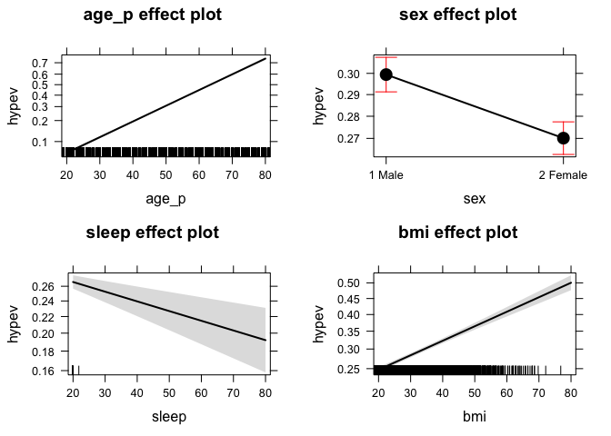
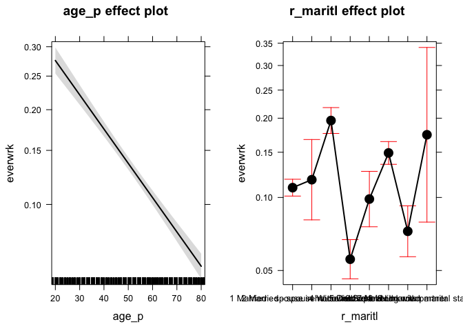

README
================
Rajesh Jagannath
July 30, 2016

R Markdown
----------

This is an R Markdown document. Markdown is a simple formatting syntax for authoring HTML, PDF, and MS Word documents. For more details on using R Markdown see <http://rmarkdown.rstudio.com>.

When you click the **Knit** button a document will be generated that includes both content as well as the output of any embedded R code chunks within the document. You can embed an R code chunk like this:

Regression with binary outcomes
===============================

═════════════════════════════════

\#\#\#Logistic regression ───────────────────────

This far we have used the `lm' function to fit our regression models.`lm' is great, but limited–in particular it only fits models for continuous dependent variables. For categorical dependent variables we can use the \`glm()' function.

For these models we will use a different dataset, drawn from the National Health Interview Survey. From the \[CDC website\]:

         The National Health Interview Survey (NHIS) has monitored
         the health of the nation since 1957. NHIS data on a broad
         range of health topics are collected through personal
         household interviews. For over 50 years, the U.S. Census
         Bureau has been the data collection agent for the National
         Health Interview Survey. Survey results have been
         instrumental in providing data to track health status,
         health care access, and progress toward achieving national
         health objectives.

Load the National Health Interview Survey data:

``` r
NH11 <- readRDS("dataSets/NatHealth2011.rds")
labs <- attributes(NH11)$labels
```

\[CDC website\] <http://www.cdc.gov/nchs/nhis.htm>

### Logistic regression example

───────────────────────────────

Let's predict the probability of being diagnosed with hypertension based on age, sex, sleep, and bmi

``` r
str(NH11$hypev) # check stucture of hypev
```

    ##  Factor w/ 5 levels "1 Yes","2 No",..: 2 2 1 2 2 1 2 2 1 2 ...

``` r
levels(NH11$hypev) # check levels of hypev
```

    ## [1] "1 Yes"             "2 No"              "7 Refused"        
    ## [4] "8 Not ascertained" "9 Don't know"

``` r
# collapse all missing values to NA
summary(NH11$hypev)
```

    ##             1 Yes              2 No         7 Refused 8 Not ascertained 
    ##             10672             22296                20                 0 
    ##      9 Don't know 
    ##                26

``` r
# what this does is that it collapeses the 
NH11$hypev <- factor(NH11$hypev, levels=c("2 No", "1 Yes"))
levels(NH11$hypev)
```

    ## [1] "2 No"  "1 Yes"

``` r
summary(NH11$hypev)
```

    ##  2 No 1 Yes  NA's 
    ## 22296 10672    46

``` r
summary(NH11)
```

    ##      fmx                fpx               wtia_sa           wtfa_sa     
    ##  Length:33014       Length:33014       Min.   :  780.2   Min.   :  846  
    ##  Class :character   Class :character   1st Qu.: 2933.3   1st Qu.: 3613  
    ##  Mode  :character   Mode  :character   Median : 4494.4   Median : 5612  
    ##                                        Mean   : 5607.1   Mean   : 7008  
    ##                                        3rd Qu.: 7278.1   3rd Qu.: 9026  
    ##                                        Max.   :65211.6   Max.   :71281  
    ##                                                                         
    ##      region         strat_p        psu_p            sex       
    ##  Min.   :1.000   Min.   :  1   Min.   :1.00   1 Male  :14811  
    ##  1st Qu.:2.000   1st Qu.: 82   1st Qu.:1.00   2 Female:18203  
    ##  Median :3.000   Median :157   Median :1.00                   
    ##  Mean   :2.713   Mean   :155   Mean   :1.49                   
    ##  3rd Qu.:4.000   3rd Qu.:233   3rd Qu.:2.00                   
    ##  Max.   :4.000   Max.   :300   Max.   :2.00                   
    ##                                                               
    ##                            hispan_i    
    ##  12 Not Hispanic/Spanish origin:27147  
    ##  02 Mexican                    : 2181  
    ##  03 Mexican-American           : 1348  
    ##  06 Central or South American  :  955  
    ##  01 Puerto Rico                :  567  
    ##  04 Cuban/Cuban American       :  295  
    ##  (Other)                       :  521  
    ##                              mracrpi2         age_p      
    ##  01 White                        :25074   Min.   :18.00  
    ##  02 Black/African American       : 5193   1st Qu.:33.00  
    ##  15 Other Asian (See file layout):  818   Median :47.00  
    ##  10 Chinese                      :  477   Mean   :48.11  
    ##  11 Filipino                     :  468   3rd Qu.:62.00  
    ##  09 Asian Indian                 :  403   Max.   :85.00  
    ##  (Other)                         :  581                  
    ##                             r_maritl                  everwrk     
    ##  1 Married - spouse in household:13943   1 Yes            :12153  
    ##  7 Never married                : 7763   2 No             : 1887  
    ##  5 Divorced                     : 4511   7 Refused        :   17  
    ##  4 Widowed                      : 3069   8 Not ascertained:    0  
    ##  8 Living with partner          : 2002   9 Don't know     :    8  
    ##  6 Separated                    : 1121   NA's             :18949  
    ##  (Other)                        :  605                            
    ##    hypev                     aasmev                    aasmyr     
    ##  2 No :22296   1 Yes            : 4100   1 Yes            : 1335  
    ##  1 Yes:10672   2 No             :28882   2 No             : 2749  
    ##  NA's :   46   7 Refused        :    9   7 Refused        :    0  
    ##                8 Not ascertained:    0   8 Not ascertained:    0  
    ##                9 Don't know     :   23   9 Don't know     :   16  
    ##                                          NA's             :28914  
    ##                                                                   
    ##                dibev           dibage         difage2     
    ##  1 Yes            : 3242   Min.   : 1.00   Min.   : 0.00  
    ##  2 No             :29260   1st Qu.:40.00   1st Qu.: 4.00  
    ##  3 Borderline     :  485   Median :50.00   Median : 9.00  
    ##  7 Refused        :   11   Mean   :49.72   Mean   :14.96  
    ##  8 Not ascertained:    0   3rd Qu.:60.00   3rd Qu.:18.00  
    ##  9 Don't know     :   16   Max.   :99.00   Max.   :99.00  
    ##                            NA's   :29772   NA's   :29772  
    ##                insln                    dibpill     
    ##  1 Yes            :  945   1 Yes            : 2560  
    ##  2 No             : 3765   2 No             : 2146  
    ##  7 Refused        :    0   7 Refused        :    0  
    ##  8 Not ascertained:    0   8 Not ascertained:    0  
    ##  9 Don't know     :    1   9 Don't know     :    5  
    ##  NA's             :28303   NA's             :28303  
    ##                                                     
    ##                arth1                    arthlmt          wkdayr       
    ##  1 Yes            : 8181   1 Yes            : 5058   Min.   :  0.000  
    ##  2 No             :24788   2 No             : 8445   1st Qu.:  0.000  
    ##  7 Refused        :    8   7 Refused        :    0   Median :  0.000  
    ##  8 Not ascertained:    0   8 Not ascertained:    0   Mean   :  7.261  
    ##  9 Don't know     :   37   9 Don't know     :    4   3rd Qu.:  2.000  
    ##                            NA's             :19507   Max.   :999.000  
    ##                                                      NA's   :11762    
    ##     beddayr                    aflhca18        aldura10    
    ##  Min.   :  0.00   1 Mentioned      :  683   Min.   : 0.00  
    ##  1st Qu.:  0.00   2 Not mentioned  :11892   1st Qu.: 5.00  
    ##  Median :  0.00   7 Refused        :   17   Median :10.00  
    ##  Mean   : 11.25   8 Not ascertained:   20   Mean   :14.07  
    ##  3rd Qu.:  2.00   9 Don't know     :  104   3rd Qu.:19.00  
    ##  Max.   :999.00   NA's             :20298   Max.   :99.00  
    ##                                             NA's   :32377  
    ##     aldura17        aldura18                   smkev          cigsday     
    ##  Min.   : 0.00   Min.   : 0.00   1 Yes            :13443   Min.   : 1.00  
    ##  1st Qu.: 5.00   1st Qu.: 4.00   2 No             :19491   1st Qu.: 5.00  
    ##  Median :12.00   Median :10.00   7 Refused        :   32   Median :10.00  
    ##  Mean   :18.05   Mean   :18.19   8 Not ascertained:   28   Mean   :12.98  
    ##  3rd Qu.:25.00   3rd Qu.:26.00   9 Don't know     :   20   3rd Qu.:20.00  
    ##  Max.   :99.00   Max.   :99.00                             Max.   :99.00  
    ##  NA's   :31905   NA's   :32331                             NA's   :26833  
    ##      vigmin           modmin            bmi            sleep       
    ##  Min.   : 10.00   Min.   : 10.00   Min.   :11.81   Min.   : 3.000  
    ##  1st Qu.: 30.00   1st Qu.: 20.00   1st Qu.:23.57   1st Qu.: 6.000  
    ##  Median : 45.00   Median : 30.00   Median :26.76   Median : 7.000  
    ##  Mean   : 60.58   Mean   : 55.68   Mean   :29.90   Mean   : 7.862  
    ##  3rd Qu.: 60.00   3rd Qu.: 60.00   3rd Qu.:31.31   3rd Qu.: 8.000  
    ##  Max.   :999.00   Max.   :999.00   Max.   :99.99   Max.   :99.000  
    ##  NA's   :19126    NA's   :14591                                    
    ##                            ausualpl    
    ##  1 Yes                         :27494  
    ##  2 There is NO place           : 5061  
    ##  3 There is MORE THAN ONE place:  348  
    ##  7 Refused                     :   10  
    ##  8 Not ascertained             :   92  
    ##  9 Don't know                  :    9  
    ## 

### run our regression model

``` r
hyp.out <- glm(hypev~age_p+sex+sleep+bmi,
              data=NH11, family="binomial")
coef(summary(hyp.out))
```

    ##                 Estimate   Std. Error    z value     Pr(>|z|)
    ## (Intercept) -4.269466028 0.0564947294 -75.572820 0.000000e+00
    ## age_p        0.060699303 0.0008227207  73.778743 0.000000e+00
    ## sex2 Female -0.144025092 0.0267976605  -5.374540 7.677854e-08
    ## sleep       -0.007035776 0.0016397197  -4.290841 1.779981e-05
    ## bmi          0.018571704 0.0009510828  19.526906 6.485172e-85

### Logistic regression coefficients

────────────────────────────────────

Generalized linear models use link functions, so raw coefficients are difficult to interpret. For example, the age coefficient of .06 in the previous model tells us that for every one unit increase in age, the log odds of hypertension diagnosis increases by 0.06. Since most of us are not used to thinking in log odds this is not too helpful!

One solution is to transform the coefficients to make them easier to interpret

``` r
hyp.out.tab <- coef(summary(hyp.out))
hyp.out.tab[, "Estimate"] <- exp(coef(hyp.out))
hyp.out.tab
```

    ##               Estimate   Std. Error    z value     Pr(>|z|)
    ## (Intercept) 0.01398925 0.0564947294 -75.572820 0.000000e+00
    ## age_p       1.06257935 0.0008227207  73.778743 0.000000e+00
    ## sex2 Female 0.86586602 0.0267976605  -5.374540 7.677854e-08
    ## sleep       0.99298892 0.0016397197  -4.290841 1.779981e-05
    ## bmi         1.01874523 0.0009510828  19.526906 6.485172e-85

### Generating predicted values

───────────────────────────────

In addition to transforming the log-odds produced by `glm' to odds, we    can use the`predict()' function to make direct statements about the predictors in our model. For example, we can ask "How much more likely is a 63 year old female to have hypertension compared to a 33 year old female?".

Create a dataset with predictors set at desired levels

``` r
predDat <- with(NH11,
                expand.grid(age_p = c(33, 63),
                            sex = "2 Female",
                            bmi = mean(bmi, na.rm = TRUE),
                            sleep = mean(sleep, na.rm = TRUE)))
# predict hypertension at those levels
cbind(predDat, predict(hyp.out, type = "response",
                       se.fit = TRUE, interval="confidence",
                       newdata = predDat))
```

    ##   age_p      sex      bmi   sleep       fit      se.fit residual.scale
    ## 1    33 2 Female 29.89565 7.86221 0.1289227 0.002849622              1
    ## 2    63 2 Female 29.89565 7.86221 0.4776303 0.004816059              1

This tells us that a 33 year old female has a 13% probability of having been diagnosed with hypertension, while and 63 year old female has a 48% probability of having been diagnosed.

### Packages for computing and graphing predicted values

─────────────────────────────────────────────────────────

Instead of doing all this ourselves, we can use the effects package to compute quantities of interest for us (cf. the Zelig package).



### Exercise: logistic regression

───────────────────────────────────

Use the NH11 data set that we loaded earlier.

1.  Use glm to conduct a logistic regression to predict ever worked (everwrk) using age (age\_p) and marital status (r\_maritl).
2.  Predict the probability of working for each level of marital status.

Note that the data is not perfectly clean and ready to be modeled. You will need to clean up at least some of the variables before fitting the model.

``` r
nh11_ear <- subset(NH11, select = c("everwrk", "age_p", "r_maritl"))
summary(nh11_ear)
```

    ##               everwrk          age_p      
    ##  1 Yes            :12153   Min.   :18.00  
    ##  2 No             : 1887   1st Qu.:33.00  
    ##  7 Refused        :   17   Median :47.00  
    ##  8 Not ascertained:    0   Mean   :48.11  
    ##  9 Don't know     :    8   3rd Qu.:62.00  
    ##  NA's             :18949   Max.   :85.00  
    ##                                           
    ##                             r_maritl    
    ##  1 Married - spouse in household:13943  
    ##  7 Never married                : 7763  
    ##  5 Divorced                     : 4511  
    ##  4 Widowed                      : 3069  
    ##  8 Living with partner          : 2002  
    ##  6 Separated                    : 1121  
    ##  (Other)                        :  605

``` r
levels(nh11_ear$everwrk)
```

    ## [1] "1 Yes"             "2 No"              "7 Refused"        
    ## [4] "8 Not ascertained" "9 Don't know"

### There are NAs

Remove the records with NAs
---------------------------

``` r
cleanedup_nh11_ear <- na.omit(nh11_ear)
levels(cleanedup_nh11_ear$everwrk)
```

    ## [1] "1 Yes"             "2 No"              "7 Refused"        
    ## [4] "8 Not ascertained" "9 Don't know"

``` r
summary(cleanedup_nh11_ear)
```

    ##               everwrk          age_p      
    ##  1 Yes            :12153   Min.   :18.00  
    ##  2 No             : 1887   1st Qu.:39.00  
    ##  7 Refused        :   17   Median :60.00  
    ##  8 Not ascertained:    0   Mean   :55.98  
    ##  9 Don't know     :    8   3rd Qu.:73.00  
    ##                            Max.   :85.00  
    ##                                           
    ##                             r_maritl   
    ##  1 Married - spouse in household:5464  
    ##  7 Never married                :2851  
    ##  4 Widowed                      :2525  
    ##  5 Divorced                     :1908  
    ##  8 Living with partner          : 601  
    ##  6 Separated                    : 468  
    ##  (Other)                        : 248

Create a model
--------------

``` r
everwrk.out <- glm(everwrk~age_p+r_maritl,
               data=cleanedup_nh11_ear, family="binomial")


coef(summary(everwrk.out))
```

    ##                                                Estimate  Std. Error
    ## (Intercept)                                 -0.45415880 0.093080415
    ## age_p                                       -0.02934571 0.001633363
    ## r_maritl2 Married - spouse not in household  0.08145957 0.213835768
    ## r_maritl4 Widowed                            0.68688235 0.083623142
    ## r_maritl5 Divorced                          -0.73211254 0.111144918
    ## r_maritl6 Separated                         -0.11644701 0.150189947
    ## r_maritl7 Never married                      0.35522972 0.068864919
    ## r_maritl8 Living with partner               -0.44622604 0.137653720
    ## r_maritl9 Unknown marital status             0.54103849 0.457837543
    ##                                                 z value     Pr(>|z|)
    ## (Intercept)                                  -4.8792091 1.065121e-06
    ## age_p                                       -17.9664355 3.569242e-72
    ## r_maritl2 Married - spouse not in household   0.3809446 7.032444e-01
    ## r_maritl4 Widowed                             8.2140223 2.138998e-16
    ## r_maritl5 Divorced                           -6.5870087 4.487759e-11
    ## r_maritl6 Separated                          -0.7753316 4.381438e-01
    ## r_maritl7 Never married                       5.1583553 2.491285e-07
    ## r_maritl8 Living with partner                -3.2416562 1.188373e-03
    ## r_maritl9 Unknown marital status              1.1817259 2.373145e-01

Plot
----

``` r
plot(allEffects(everwrk.out))
```



Note that the `echo = FALSE` parameter was added to the code chunk to prevent printing of the R code that generated the plot.
